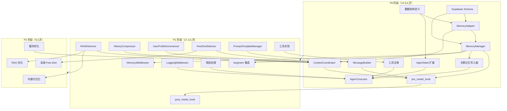

# LangChain/LangGraph 官方能力与项目架构对比分析

> 基于官方文档的框架内置能力 vs 自定义开发需求详细对比

**文档版本**: v1.0
**创建日期**: 2026-03-11
**适用项目**: agent_app (Multi-Tool AI Agent 架构研究)

---

## 一、文档说明与对比方法论

### 1.1 文档目的与适用范围

本文档旨在为开发团队提供一份全面的 LangChain/LangGraph 官方能力与项目架构设计的对比分析，帮助开发者：

1. **快速识别**哪些功能可以直接使用 LangChain/LangGraph 框架能力
2. **明确界定**哪些功能需要自定义开发及原因
3. **了解优先级**各模块的开发优先级和依赖关系
4. **获得指导**具体的实施建议和代码示例

### 1.2 对比维度定义

本文档从以下三个维度进行对比分析：

| 维度 | 说明 | 开发方式 |
|-----|------|---------|
| **框架内置（✅）** | LangChain/LangGraph 已完全实现，配置即可使用 | 直接使用，无需开发 |
| **框架提供接口（⚡）** | 框架提供接口和抽象层，需编写少量胶水代码 | 少量自定义逻辑（10-50行） |
| **完全自定义（🔧）** | 涉及具体业务逻辑，框架无法预设 | 完全自定义开发（100+行） |

### 1.3 图例说明

- ✅ **框架内置**：无需开发，配置即用
- ⚡ **框架接口**：需少量胶水代码连接业务逻辑
- 🔧 **自定义开发**：需要完整实现业务逻辑
- 📦 **官方扩展包**：需额外安装的官方包
- **P0/P1/P2**：开发优先级等级

### 1.4 官方文档引用来源

本文档引用的官方文档包括：

- **[LangChain Core Reference](https://reference.langchain.com/python/langchain-core)** - 核心 API 参考
- **[LangGraph Documentation](https://langchain-ai.github.io/langgraph/)** - LangGraph 专用文档
- **[Structured Output](https://docs.langchain.com/oss/python/langchain/structured-output)** - 结构化输出指南
- **[Memory Management](https://docs.langchain.com/oss/python/langgraph/how-tos/memory/)** - 记忆管理
- **[RAG Documentation](https://docs.langchain.com/oss/python/langchain/retrieval)** - RAG 检索
- **[langmem SDK Launch](https://blog.langchain.com/langmem-sdk-launch/)** - langmem 官方工具包

---

## 二、LLM 模块对比

### 2.1 框架内置能力

LLM 模块是 LangChain 1.0 的核心能力，项目无需任何自定义开发。

| 功能 | 英文术语 | 框架支持 | 说明 |
|-----|---------|---------|------|
| 统一内容块 | Content Blocks Property | ✅ 支持 | 提供对现代 LLM 功能的一致性访问 |
| 标准化接口 | Standardized Model Interface | ✅ 支持 | 统一不同提供商的 API 调用格式 |
| 多模型支持 | Multi-Provider Support | ✅ 支持 | OpenAI、Anthropic、Google、xAI、Amazon 等 |
| 流式输出 | Streaming Output | ✅ 支持 | 完整的流式响应处理 |
| 结构化输出 | Structured Output | ✅ 支持 | response_format，内置输出解析和验证 |
| 推理能力 | Reasoning Capabilities | ✅ 支持 | 支持复杂推理和问题解决 |
| 引用支持 | Citations | ✅ 支持 | 提供来源追踪和引用 |
| 服务器端工具执行 | Server-side Tool Execution | ✅ 支持 | 增强的工具处理和执行 |

#### 使用示例

```python
from langchain_core.messages import HumanMessage
from langchain_openai import ChatOpenAI

# 初始化模型（支持多种提供商）
llm = ChatOpenAI(model="gpt-4", temperature=0)

# 标准化调用
response = await llm.ainvoke([
    HumanMessage(content="你好，请介绍一下你自己")
])

# 流式输出
async for chunk in llm.astream(messages):
    print(chunk.content, end="")

# 结构化输出
from pydantic import BaseModel
class ResponseFormat(BaseModel):
    answer: str
    confidence: float

structured_llm = llm.with_structured_output(ResponseFormat)
```

**官方文档链接**：
- [LangChain Core Reference](https://reference.langchain.com/python/langchain-core)
- [Structured Output Documentation](https://docs.langchain.com/oss/python/langchain/structured-output)

### 2.2 需要自定义开发的功能

**无需自定义开发**

LLM 模块的所有功能都由 LangChain 1.0 完整提供，无需任何自定义实现。

### 2.3 对比汇总表

| 功能分类 | 具体功能 | 框架支持状态 | 开发方式 | 优先级 | 原因说明 |
|---------|---------|------------|---------|-------|---------|
| LLM 调用 | 统一接口 | ✅ 支持 | 直接使用 | - | 官方已标准化所有主流 LLM 提供商 |
| 内容块 | Content Blocks | ✅ 支持 | 直接使用 | - | 官方已实现多模态内容统一抽象 |
| 流式输出 | Streaming | ✅ 支持 | 直接使用 | - | 官方提供完整的流式 API |
| 结构化输出 | Structured Output | ✅ 支持 | 直接使用 | - | 官方支持 Pydantic/JSON Schema 验证 |
| 推理能力 | Reasoning | ✅ 支持 | 直接使用 | - | 依赖底层模型能力，框架透传支持 |

### 2.4 开发建议与优先级

**优先级**: 无（无需开发）

**建议**：
1. 直接使用 LangChain 的标准化接口
2. 利用 `with_structured_output()` 实现类型安全的结构化输出
3. 使用 `astream()` 实现流式响应以提升用户体验
4. 无需封装额外的抽象层

---

## 三、Memory 模块对比

### 3.1 框架内置能力

LangGraph 1.0 提供了完整的记忆管理基础设施。

#### 3.1.1 短期记忆 - AsyncPostgresSaver

**功能描述**: 会话内的短期记忆自动持久化，支持中断后的状态恢复。

**为什么可以直接使用**:
框架已完全实现该功能，覆盖了会话历史持久化的所有场景。官方实现经过大规模生产验证，支持事务安全、并发控制，无需重复开发。

**使用方式**:
```python
from langgraph.checkpoint.postgres import AsyncPostgresSaver

# 初始化（自动创建 checkpoint 表）
checkpointer = AsyncPostgresSaver.from_conn_string(DATABASE_URL)
await checkpointer.setup()

# 在 Agent 中使用
agent = create_react_agent(
    model=llm,
    tools=tools,
    checkpointer=checkpointer  # 自动持久化会话历史
)

# 恢复会话
config = {"configurable": {"thread_id": "user_123"}}
response = await agent.invoke(input_data, config)
```

**官方文档**: [AsyncPostgresSaver Documentation](https://langchain-ai.github.io/langgraph/concepts/persistence/)

#### 3.1.2 长期记忆 - PostgresStore

**功能描述**: 跨会话的长期记忆存储，基于 BaseStore 接口的键值对存储。

**为什么可以直接使用**:
框架提供了生产级的键值存储实现，支持类型安全、批量操作、查询优化，已通过官方验证。

**使用方式**:
```python
from langgraph.store.postgres import PostgresStore

# 初始化（自动创建 store 表）
store = PostgresStore(conn_string=DATABASE_URL)
await store.setup()

# 存储长期记忆（如用户偏好）
namespace = ("episodic", "user_123")
await store.put(
    namespace=namespace,
    key="profile",
    value={"name": "张三", "preferences": {"language": "zh-CN"}}
)

# 检索长期记忆
profile = await store.get(namespace=namespace, key="profile")
```

**官方文档**: [BaseStore API Reference](https://reference.langchain.com/python/langchain_core/stores)

#### 3.1.3 记忆工具 - langmem SDK

**功能描述**: LangChain 官方提供的记忆管理工具包，包含 Agent 主动保存和检索记忆的能力。

**需要安装**: `pip install langmem`

**功能清单**:
- `create_manage_memory_tool`：Agent 主动保存记忆的工具
- `create_search_memory_tool`：Agent 检索记忆的工具
- `create_memory_store_manager`：自动提炼用户偏好的后台服务
- `ReflectionExecutor`：异步延迟触发记忆更新

**为什么需要少量代码**:
框架提供了工具接口，但需要将这些工具注册到 Agent 的工具列表中，并配置命名空间（namespace）以隔离不同用户的记忆。

**使用方式**:
```python
from langmem import create_manage_memory_tool, create_search_memory_tool

# 创建记忆工具
manage_memory = create_manage_memory_tool(store)
search_memory = create_search_memory_tool(store)

# 添加到 Agent 工具列表
tools = [manage_memory, search_memory, ...other_tools]

# Agent 会自动使用这些工具进行记忆管理
```

**官方文档**: [langmem SDK Launch](https://blog.langchain.com/langmem-sdk-launch/)

#### 3.1.4 消息压缩 - SummarizationMiddleware

**功能描述**: 历史消息自动压缩，减少 Token 消耗。

**框架来源**: deepagents（非官方，但社区广泛使用）

**使用方式**:
```python
from deepagents import SummarizationMiddleware

middleware = SummarizationMiddleware(
    llm=llm,
    max_tokens=4000,
    summary_threshold=3000
)
```

### 3.2 需要自定义开发的功能

#### 3.2.1 MemoryManager（核心组件，P0）

**为什么需要自定义**:
该功能涉及用户画像的读取和过滤逻辑，框架无法预设统一的业务规则。不同应用对"相关记忆"的定义差异很大（如时间范围、相关性阈值），需要根据业务需求自定义检索和过滤策略。

**实现要点**:
- **核心**: 从 PostgresStore 读取后，根据业务规则过滤和组装记忆内容
- **依赖**: `store.get(namespace=("episodic", user_id), key="profile")`
- **数据结构**: 返回 `EpisodicData`（用户画像对象）

**代码框架**:
```python
class MemoryManager:
    def __init__(self, store: PostgresStore):
        self.store = store

    async def load_episodic(self, user_id: str) -> EpisodicData:
        """从长期记忆加载用户画像"""
        namespace = ("episodic", user_id)
        result = await self.store.get(namespace=namespace, key="profile")
        return EpisodicData.parse_obj(result.value) if result else EpisodicData()

    async def save_episodic(self, user_id: str, data: EpisodicData):
        """保存用户画像到长期记忆"""
        namespace = ("episodic", user_id)
        await self.store.put(namespace=namespace, key="profile", value=data.dict())

    def build_working_memory(self, episodic: EpisodicData) -> str:
        """构建注入 System Prompt 的记忆内容"""
        # 根据业务规则组装记忆文本
        return f"用户画像: {episodic.summary}\n偏好: {episodic.preferences}"
```

**代码量**: 约 50-100 行

#### 3.2.2 MemoryMiddleware（P0）

**为什么需要自定义**:
框架提供了中间件接口，但需要编写具体的记忆加载和注入逻辑。每个 turn 开始时自动加载长期记忆，每次 LLM 调用时注入记忆，这些业务逻辑需要自行实现。

**实现要点**:
- **before_agent**: 每个 turn 开始触发，调用 `load_episodic()` 加载长期记忆
- **wrap_model_call**: 每次 LLM 调用前，将记忆注入消息列表
- **依赖**: MemoryManager、AgentState

**代码框架**:
```python
class MemoryMiddleware:
    def __init__(self, memory_manager: MemoryManager):
        self.mm = memory_manager

    async def before_agent(self, state: AgentState, user_id: str):
        """每个 turn 开始前加载长期记忆"""
        episodic = await self.mm.load_episodic(user_id)
        state["episodic_memory"] = episodic
        return state

    def wrap_model_call(self, original_func):
        """包装 LLM 调用，注入记忆"""
        async def wrapper(messages, **kwargs):
            # 从 AgentState 获取记忆并注入消息
            memory_context = self.build_memory_context()
            enhanced_messages = [SystemMessage(content=memory_context)] + messages
            return await original_func(enhanced_messages, **kwargs)
        return wrapper
```

**代码量**: 约 80-120 行

#### 3.2.3 数据结构定义（P0）

**为什么需要自定义**:
框架提供的是通用的键值存储，具体的数据结构（如用户画像包含哪些字段）需要根据业务需求定义。

**实现要点**:
- 使用 Pydantic 定义数据模型
- 支持序列化/反序列化
- 与 PostgresStore 的值类型兼容

**代码示例**:
```python
from pydantic import BaseModel
from typing import Optional, Dict, Any

class EpisodicData(BaseModel):
    """用户画像数据结构"""
    user_id: str
    summary: str = ""  # 用户画像摘要
    preferences: Dict[str, Any] = {}  # 用户偏好
    interaction_count: int = 0  # 交互次数
    last_updated: str = ""  # 最后更新时间

class MemoryContext(BaseModel):
    """记忆上下文"""
    episodic: EpisodicData  # 长期记忆
    short_term: list = []  # 短期消息历史（由 checkpointer 管理）
```

**代码量**: 约 30-50 行

#### 3.2.4 AgentState 字段扩展（P0）

**为什么需要少量代码**:
框架提供了 `TypedDict` 定义状态，但需要添加业务相关的字段（如 `episodic_memory`、`tool_records` 等）。

**实现要点**:
- 继承或扩展框架的 `AgentState`
- 添加业务字段注解
- 配合 `reducer` 函数处理状态更新

**代码示例**:
```python
from typing import Annotated, Sequence
from langgraph.graph import add_messages

class AgentState(TypedDict):
    """扩展的 Agent 状态"""
    messages: Annotated[Sequence[BaseMessage], add_messages]
    episodic_memory: Optional[EpisodicData]  # 长期记忆
    tool_records: list[dict]  # 工具执行记录
    intermediate_state: dict = {}  # 中间状态
    error_log: list[str] = []  # 错误日志
```

**代码量**: 约 20-30 行

#### 3.2.5 Supabase Schema（P0）

**为什么需要少量代码**:
AsyncPostgresSaver 和 PostgresStore 会自动创建表，但业务表（如 AgentTrace）需要手动定义。

**SQL 示例**:
```sql
-- Agent 执行追踪表（自定义）
CREATE TABLE agent_trace (
    id UUID PRIMARY KEY DEFAULT gen_random_uuid(),
    user_id TEXT NOT NULL,
    session_id TEXT NOT NULL,
    turn_id INTEGER NOT NULL,
    tool_calls JSONB,
    llm_calls JSONB,
    created_at TIMESTAMP DEFAULT NOW()
);
```

**代码量**: 约 20-50 行 SQL

### 3.3 数据结构映射关系

```
框架层（LangGraph）
├── AsyncPostgresSaver → checkpoint 表（自动）
│   └── 存储: AgentState（messages, current_turn）
└── PostgresStore → store 表（自动）
    └── 存储: 键值对（namespace + key + value）

自定义层（项目）
├── EpisodicData → 用户画像（存储在 PostgresStore）
│   ├── namespace: ("episodic", user_id)
│   └── key: "profile"
├── MemoryContext → 记忆上下文（运行时组装）
│   ├── episodic: EpisodicData（从 store 读取）
│   └── short_term: list（从 checkpointer 读取）
└── AgentState → 扩展的状态字段
    ├── episodic_memory: EpisodicData
    ├── tool_records: list
    └── intermediate_state: dict
```

### 3.4 对比汇总表

| 功能分类 | 具体功能 | 框架支持状态 | 开发方式 | 优先级 | 原因说明 |
|---------|---------|------------|---------|-------|---------|
| 短期记忆 | 会话持久化 | ✅ 支持 | 直接使用 | - | AsyncPostgresSaver 完全实现 |
| 长期记忆 | 键值存储 | ✅ 支持 | 直接使用 | - | PostgresStore 生产级实现 |
| 记忆工具 | 主动保存/检索 | 📦 扩展包 | 少量代码 | P1 | 需注册工具和配置 namespace |
| 消息压缩 | 历史摘要 | 📦 扩展包 | 直接使用 | P2 | deepagents 的 SummarizationMiddleware |
| 记忆管理 | 用户画像读写 | ⚡ 接口 | 自定义逻辑 | **P0** | 业务相关，框架无法预设过滤规则 |
| 中间件 | 记忆注入 | ⚡ 接口 | 自定义逻辑 | **P0** | 需实现加载和注入的业务逻辑 |
| 数据结构 | EpisodicData | 🔧 无 | 完全自定义 | **P0** | 业务字段需自定义定义 |
| 状态扩展 | AgentState 字段 | ⚡ 接口 | 少量代码 | **P0** | 继承 TypedDict 并添加字段 |
| 业务表 | AgentTrace | 🔧 无 | 完全自定义 | **P0** | 业务追踪表需手动创建 |

### 3.5 开发建议与优先级

**总体优先级**: P0（核心模块）

**实施顺序**:
1. **Phase 1（P0）** - 基础设施
   - 定义数据结构（EpisodicData、MemoryContext、AgentState）
   - 实现 MemoryManager 核心方法（load_episodic、save_episodic）
   - 实现 MemoryMiddleware（before_agent、wrap_model_call）
   - 创建 Supabase Schema

2. **P1** - langmem 集成
   - 安装 langmem SDK
   - 创建记忆工具（create_manage_memory_tool、create_search_memory_tool）
   - 配置 namespace 隔离
   - 注册到 Agent 工具列表

3. **P2** - 高级功能
   - 集成 SummarizationMiddleware 实现自动压缩
   - 实现 ReflectionExecutor 异步更新记忆
   - 扩展 Procedural/Semantic Memory

**依赖关系**:
```
数据结构定义 (P0)
    ↓
MemoryManager 实现 (P0)
    ↓
MemoryMiddleware 实现 (P0)
    ↓
langmem 工具集成 (P1)
    ↓
高级记忆功能 (P2)
```

**风险提示**:
- AsyncPostgresSaver 需要正确配置连接池，注意并发限制
- PostgresStore 的 namespace 设计要考虑隔离性和查询效率
- 记忆注入可能增加 Token 消耗，需要控制记忆内容长度

---

## 四、Tool 模块对比

### 4.1 框架内置能力

LangGraph 提供了完整的工具执行基础设施。

#### 4.1.1 ToolNode v2 - 并行工具执行

**功能描述**: 自动并行执行多个工具，使用 Send API 实现真正的并发调用。

**为什么可以直接使用**:
框架已完全实现工具调度的并发控制、结果聚合、错误处理等复杂逻辑，经过大规模生产验证。

**使用方式**:
```python
from langgraph.prebuilt import ToolNode

# 创建工具节点
tools = [search_tool, calculator_tool, weather_tool]
tool_node = ToolNode(tools)

# 在图中使用（自动并行执行）
graph = StateGraph(state_schema)
graph.add_node("tools", tool_node)
graph.add_conditional_edges("agent", should_continue)  # 自动判断是否调用工具
```

**官方文档**: [ToolNode Documentation](https://langchain-ai.github.io/langgraph/reference/tools/#langgraph.prebuilt.ToolNode)

#### 4.1.2 create_agent / create_react_agent - 预构建组件

**功能描述**: 快速创建 ReAct 模式的 Agent，自动处理工具调用循环。

**为什么可以直接使用**:
框架提供了完整的 ReAct 执行流程，包括推理-行动循环、工具结果解析、错误重试等，无需重复实现。

**使用方式**:
```python
from langgraph.prebuilt import create_react_agent

# 一行代码创建 Agent
agent = create_react_agent(
    model=llm,
    tools=tools,
    state_modifier=system_prompt  # 可选：系统提示
)

# 执行
response = await agent.ainvoke({"messages": [user_input]})
```

**官方文档**: [Agent Documentation](https://docs.langchain.com/oss/python/langchain/agents)

#### 4.1.3 @tool 装饰器 - 快速创建工具

**功能描述**: 使用装饰器快速将 Python 函数转换为 LangChain 工具。

**为什么可以直接使用**:
框架提供了完整的工具封装逻辑，包括参数解析、类型注解、文档字符串提取等。

**使用方式**:
```python
from langchain_core.tools import tool

@tool
def search_database(query: str) -> str:
    """在数据库中搜索信息"""
    # 实现搜索逻辑
    return results

# 自动生成工具描述和参数 Schema
print(search_database.name)  # "search_database"
print(search_database.description)  # "在数据库中搜索信息"
print(search_database.args_schema)  # 自动生成的 Pydantic 模型
```

#### 4.1.4 BaseTool 类 - 复杂工具继承

**功能描述**: 对于复杂工具，可以通过继承 BaseTool 实现自定义逻辑。

**为什么可以直接使用**:
框架提供了工具基类和完整生命周期钩子（_run、arun、_parse_input 等）。

**使用方式**:
```python
from langchain_core.tools import BaseTool
from typing import Optional, Type
from pydantic import BaseModel, Field

class SearchInput(BaseModel):
    query: str = Field(description="搜索查询")

class SearchTool(BaseTool):
    name = "search_tool"
    description = "在知识库中搜索"
    args_schema: Type[BaseModel] = SearchInput

    async def _arun(self, query: str) -> str:
        # 异步实现
        return await search_async(query)
```

### 4.2 需要自定义开发的功能

#### 4.2.1 具体业务工具（P1）

**为什么需要自定义**:
框架提供了工具的**执行机制**和**接口规范**，但工具的**具体业务逻辑**完全依赖应用场景。每个项目的搜索、计算、数据库访问等逻辑都不同，框架无法预设。

**实现要点**:
- **核心**: 实现工具的具体业务逻辑
- **依赖**: 继承 BaseTool 或使用 @tool 装饰器
- **数据结构**: 定义输入/输出的 Pydantic 模型

**示例工具清单**（项目可能需要）:

| 工具名称 | 功能描述 | 实现难度 | 优先级 |
|---------|---------|---------|-------|
| knowledge_search | 知识库检索 | 中 | P1 |
| data_analyzer | 数据分析 | 高 | P2 |
| api_caller | 外部 API 调用 | 中 | P1 |
| file_manager | 文件操作 | 低 | P1 |
| code_executor | 代码执行 | 高 | P2 |

**代码示例**:
```python
from langchain_core.tools import tool

@tool
async def knowledge_search(query: str, top_k: int = 5) -> str:
    """在知识库中搜索相关文档

    Args:
        query: 搜索查询
        top_k: 返回结果数量

    Returns:
        搜索结果的 JSON 字符串
    """
    # 1. 调用 RAG 检索器
    results = await rag_retriever.retrieve(query, top_k=top_k)

    # 2. 格式化结果
    formatted = [
        {"content": r.content, "score": r.score, "source": r.metadata["source"]}
        for r in results
    ]

    # 3. 返回 JSON 字符串
    return json.dumps(formatted, ensure_ascii=False)
```

**代码量**: 每个工具约 50-200 行（取决于业务复杂度）

#### 4.2.2 工具注册与配置（P0）

**为什么需要少量代码**:
框架提供了工具列表参数，但需要将自定义工具注册到 Agent 并配置工具描述。

**实现要点**:
- 收集所有工具实例
- 配置工具描述和参数
- 传递给 create_agent 或 ToolNode

**代码示例**:
```python
# 收集工具
tools = [
    knowledge_search,
    api_caller,
    file_manager,
    # ... 其他工具
]

# 创建 Agent
agent = create_react_agent(
    model=llm,
    tools=tools,
    checkpointer=checkpointer,
    store=store
)
```

**代码量**: 约 20-50 行

### 4.3 对比汇总表

| 功能分类 | 具体功能 | 框架支持状态 | 开发方式 | 优先级 | 原因说明 |
|---------|---------|------------|---------|-------|---------|
| 工具执行 | ToolNode 并行调度 | ✅ 支持 | 直接使用 | - | Send API 实现真正并发 |
| Agent 创建 | create_react_agent | ✅ 支持 | 直接使用 | - | 完整的 ReAct 循环实现 |
| 工具定义 | @tool 装饰器 | ✅ 支持 | 直接使用 | - | 自动生成 Schema 和描述 |
| 工具基类 | BaseTool 继承 | ✅ 支持 | 直接使用 | - | 提供完整生命周期钩子 |
| 工具注册 | 工具列表配置 | ⚡ 接口 | 少量代码 | P0 | 需收集工具实例并注册 |
| 业务工具 | 具体业务逻辑 | 🔧 无 | 完全自定义 | **P1** | 业务相关，框架无法预设 |
| 工具监控 | 执行追踪 | 🔧 无 | 完全自定义 | P2 | 业务监控需求 |

### 4.4 工具实现清单

| 工具名称 | 功能 | 实现方式 | 代码量 | 优先级 |
|---------|-----|---------|-------|-------|
| knowledge_search | 知识库检索 | 🔧 自定义 | ~100 行 | P1 |
| api_caller | 外部 API 调用 | 🔧 自定义 | ~80 行 | P1 |
| file_manager | 文件操作 | 🔧 自定义 | ~150 行 | P1 |
| data_analyzer | 数据分析 | 🔧 自定义 | ~200 行 | P2 |
| code_executor | 代码执行 | 🔧 自定义 | ~250 行 | P2 |

### 4.5 开发建议与优先级

**总体优先级**: P0（工具注册）、P1（基础工具）、P2（高级工具）

**实施顺序**:
1. **Phase 1（P0）** - 框架配置
   - 使用 ToolNode 和 create_react_agent
   - 实现工具注册逻辑
   - 配置工具描述和参数

2. **Phase 2（P1）** - 基础工具
   - 实现知识库检索工具
   - 实现外部 API 调用工具
   - 实现文件操作工具

3. **Phase 3（P2）** - 高级工具
   - 实现数据分析工具
   - 实现代码执行工具（需注意安全隔离）

**最佳实践**:
- 使用 @tool 装饰器快速创建简单工具
- 复杂工具继承 BaseTool 实现更好的控制
- 为工具编写清晰的 description，帮助 LLM 理解工具用途
- 使用 Pydantic 定义输入参数，实现类型安全
- 异步工具使用 `@tool` + `async def` 或 `BaseTool._arun`

**风险提示**:
- 代码执行工具需要沙箱隔离，避免安全风险
- 外部 API 调用需要处理超时和错误
- 工具描述不准确会导致 LLM 调用错误

---

## 五、Prompt 模块对比

### 5.1 框架内置能力

#### 5.1.1 System Prompt 支持

**功能描述**: LangGraph 支持通过 `state_modifier` 或消息列表设置 System Prompt。

**为什么可以直接使用**:
框架提供了标准的 System Prompt 注入方式，兼容所有 LLM 提供商。

**使用方式**:
```python
from langgraph.prebuilt import create_react_agent

# 方式1: 使用 state_modifier
agent = create_react_agent(
    model=llm,
    tools=tools,
    state_modifier="你是一个专业的 AI 助手，擅长帮助用户解决问题。"
)

# 方式2: 使用消息列表
system_prompt = SystemMessage(content="你是一个专业的 AI 助手")
agent = create_react_agent(
    model=llm,
    tools=tools,
    state_modifier=system_prompt
)
```

#### 5.1.2 工具描述自动注入

**功能描述**: ToolNode 会自动将工具的名称、描述、参数 Schema 注入到 System Prompt 中。

**为什么可以直接使用**:
框架自动处理工具信息的格式化和注入，确保 LLM 能够理解如何调用工具。

**实现机制**:
- ToolNode 读取所有工具的 `name`、`description`、`args_schema`
- 自动生成工具调用格式说明
- 注入到 System Prompt 或作为系统消息

#### 5.1.3 消息格式标准化

**功能描述**: LangChain 提供了 `BaseMessage` 类型系统，支持多种消息类型。

**支持的消息类型**:
- `HumanMessage`: 用户消息
- `AIMessage`: AI 回复（可包含 `tool_calls`）
- `SystemMessage`: 系统提示
- `ToolMessage`: 工具执行结果
- `FunctionMessage`: 函数调用结果（已弃用，用 ToolMessage 替代）

**使用方式**:
```python
from langchain_core.messages import HumanMessage, AIMessage, SystemMessage, ToolMessage

messages = [
    SystemMessage(content="你是一个助手"),
    HumanMessage(content="你好"),
    AIMessage(content="", tool_calls=[...]),
    ToolMessage(content="工具结果", tool_call_id="...")
]
```

### 5.2 需要自定义开发的功能

#### 5.2.1 模板管理器（P1）

**为什么需要自定义**:
框架提供了 `PromptTemplate` 类，但**模板的组织方式、版本管理、变量定义**完全依赖业务需求。不同业务场景的模板结构差异很大。

**实现要点**:
- **核心**: 管理静态 Prompt 模板，支持动态变量渲染
- **依赖**: Jinja2 或 Python f-string
- **功能**: 模板加载、变量替换、版本控制

**代码示例**:
```python
from jinja2 import Template

class PromptTemplateManager:
    def __init__(self, template_dir: str = "./prompts"):
        self.template_dir = template_dir
        self.templates = self._load_templates()

    def _load_templates(self) -> dict:
        """加载所有模板文件"""
        templates = {}
        for file in Path(self.template_dir).glob("*.j2"):
            name = file.stem
            with open(file) as f:
                templates[name] = Template(f.read())
        return templates

    def render(self, template_name: str, **kwargs) -> str:
        """渲染模板"""
        template = self.templates.get(template_name)
        if not template:
            raise ValueError(f"Template {template_name} not found")
        return template.render(**kwargs)

# 使用示例
manager = PromptTemplateManager()
system_prompt = manager.render(
    "agent_system",
    user_name="张三",
    user_context="软件开发工程师"
)
```

**模板示例** (`prompts/agent_system.j2`):
```jinja2
你是一个专业的 AI 助手。

用户信息：
- 姓名：{{ user_name }}
- 背景：{{ user_context }}

请根据用户的背景和需求提供个性化帮助。
```

**代码量**: 约 80-150 行

#### 5.2.2 消息组装器（P0）

**为什么需要自定义**:
框架提供了消息类型，但**消息的组装逻辑**（如动态 System Prompt、历史消息排序、上下文注入）需要根据业务需求实现。

**实现要点**:
- **核心**: 将系统提示、历史消息、当前输入、RAG 检索结果等组装成消息列表
- **依赖**: AgentState、ContextData
- **功能**: 消息排序、去重、Token 控制

**代码示例**:
```python
from langchain_core.messages import SystemMessage, HumanMessage, AIMessage

class MessageBuilder:
    def __init__(self, template_manager: PromptTemplateManager):
        self.tm = template_manager

    async def build_messages(
        self,
        state: AgentState,
        context: ContextData
    ) -> list[BaseMessage]:
        """组装最终消息列表"""
        messages = []

        # 1. System Prompt（动态生成）
        system_content = await self._build_system_prompt(context)
        messages.append(SystemMessage(content=system_content))

        # 2. 历史消息（从 AgentState 获取）
        messages.extend(state["messages"])

        # 3. 当前用户输入（如果有额外输入）
        if context.get("current_input"):
            messages.append(HumanMessage(content=context["current_input"]))

        # 4. RAG 检索结果（作为系统消息注入）
        if context.get("rag_results"):
            rag_content = self._format_rag_results(context["rag_results"])
            messages.append(SystemMessage(content=f"参考信息：\n{rag_content}"))

        return messages

    async def _build_system_prompt(self, context: ContextData) -> str:
        """构建动态 System Prompt"""
        return self.tm.render(
            "agent_system",
            user_name=context.user_name,
            user_context=context.user_context,
            instructions=context.instructions
        )

    def _format_rag_results(self, results: list) -> str:
        """格式化 RAG 检索结果"""
        formatted = []
        for i, r in enumerate(results, 1):
            formatted.append(f"{i}. {r['content']}\n   来源: {r['source']}")
        return "\n".join(formatted)
```

**代码量**: 约 100-200 行

#### 5.2.3 输出规范附加器（P2）

**为什么需要自定义**:
框架提供了 `with_structured_output()` 实现结构化输出，但**输出规范的格式和内容**（如 JSON Schema、XML 标签、特定格式指令）需要根据业务需求定义。

**实现要点**:
- **核心**: 根据任务类型生成结构化输出指令
- **依赖**: Pydantic 模型、JSON Schema
- **功能**: 动态生成输出格式要求

**代码示例**:
```python
class OutputSpecBuilder:
    def get_spec(self, task_type: str, schema: dict) -> str:
        """根据任务类型生成输出规范"""
        if task_type == "json":
            return f"""
请严格按照以下 JSON 格式输出：
```json
{json.dumps(schema, ensure_ascii=False, indent=2)}
```
"""
        elif task_type == "xml":
            return f"""
请使用 XML 标签输出：
<result>
    <field1>...</field1>
    <field2>...</field2>
</result>
"""
        else:
            return ""
```

**代码量**: 约 50-100 行

### 5.3 对比汇总表

| 功能分类 | 具体功能 | 框架支持状态 | 开发方式 | 优先级 | 原因说明 |
|---------|---------|------------|---------|-------|---------|
| System Prompt | 基础支持 | ✅ 支持 | 直接使用 | - | state_modifier 标准参数 |
| 工具描述 | 自动注入 | ✅ 支持 | 直接使用 | - | ToolNode 自动处理 |
| 消息类型 | BaseMessage | ✅ 支持 | 直接使用 | - | 标准 Message 类型系统 |
| 模板管理 | 模板组织 | 🔧 无 | 完全自定义 | P1 | 业务模板结构不同 |
| 消息组装 | 组装逻辑 | 🔧 无 | 完全自定义 | **P0** | 需实现动态组装和注入 |
| 输出规范 | 格式指令 | 🔧 无 | 完全自定义 | P2 | 业务输出格式不同 |

### 5.4 开发建议与优先级

**总体优先级**: P0（消息组装器）、P1（模板管理器）、P2（输出规范）

**实施顺序**:
1. **Phase 1（P0）** - 消息组装器
   - 实现 MessageBuilder 核心逻辑
   - 支持基础消息组装（System + History + Input）
   - 集成到 pre_model_hook

2. **Phase 2（P1）** - 模板管理器
   - 实现 PromptTemplateManager
   - 创建常用模板（System Prompt、任务描述等）
   - 支持变量渲染

3. **Phase 3（P2）** - 输出规范
   - 实现 OutputSpecBuilder
   - 支持多种输出格式（JSON、XML、自定义）
   - 集成到消息组装流程

**依赖关系**:
```
消息组装器 (P0)
    ↑
模板管理器 (P1)
    ↑
输出规范 (P2)
```

**最佳实践**:
- 使用 Jinja2 管理复杂模板，支持条件渲染和循环
- 模板文件存放在 `prompts/` 目录，便于版本管理
- 消息组装时注意 Token 限制，必要时进行历史压缩
- 使用 Pydantic 定义输出 Schema，确保类型安全

---

## 六、Context 管理模块对比

### 6.1 框架内置能力

#### 6.1.1 Vector DB 客户端

**功能描述**: LangChain 提供了向量数据库的标准化接口。

**支持的数据源**:
- PostgreSQL + pgvector
- Chroma
- Pinecone
- Weaviate
- Qdrant
- Faiss

**为什么可以直接使用**:
框架提供了统一的向量存储接口，支持多种向量数据库，无需自行适配。

**使用方式**:
```python
from langchain_community.vectorstores import PGVector
from langchain_openai import OpenAIEmbeddings

# 初始化向量存储
vectorstore = PGVector(
    connection_string=DATABASE_URL,
    embedding_function=OpenAIEmbeddings(),
    collection_name="knowledge_base"
)

# 搜索
results = vectorstore.similarity_search(query, k=5)
```

**官方文档**: [Vector Stores](https://docs.langchain.com/oss/python/langchain/integrations/vectorstores/)

#### 6.1.2 嵌入模型

**功能描述**: LangChain 提供了统一的嵌入模型接口。

**支持的提供商**:
- OpenAI: `text-embedding-3-small/large`
- Cohere: `embed-english-v3.0`
- HuggingFace: 开源模型
- Local: 本地嵌入模型

**为什么可以直接使用**:
框架提供了标准化接口，支持多种嵌入模型，自动处理分批和缓存。

**使用方式**:
```python
from langchain_openai import OpenAIEmbeddings

embeddings = OpenAIEmbeddings(model="text-embedding-3-small")

# 嵌入文本
vector = await embeddings.aembed_query("查询文本")

# 批量嵌入
vectors = await embeddings.aembed_documents(["文档1", "文档2"])
```

#### 6.1.3 LLM 摘要能力

**功能描述**: 使用 LLM 生成文本摘要，用于历史消息压缩。

**为什么可以直接使用**:
框架透传了 LLM 的摘要能力，通过调整 Prompt 即可实现压缩。

**使用方式**:
```python
summary_prompt = """
请将以下对话历史压缩为简要摘要：
{history}

摘要要点：
1. 保留关键信息
2. 省略冗余细节
3. 使用列表形式
"""

summary = await llm.ainvoke(summary_prompt.format(history=messages))
```

### 6.2 需要自定义开发的功能

Context 模块是**核心自定义开发区域**，框架只提供基础组件（向量库、嵌入模型），所有**业务逻辑**都需要自己实现。

#### 6.2.1 RAG 检索器（P1）

**为什么需要自定义**:
框架提供了向量搜索接口，但**检索策略**（如多路召回、重排序、混合检索）完全依赖业务需求。不同业务的知识结构、相关性标准、排序逻辑差异很大。

**实现要点**:
- **核心**: 根据用户输入从向量库检索知识片段
- **依赖**: VectorStore、Embeddings
- **功能**: 语义检索、关键词检索、混合检索、结果重排序

**代码示例**:
```python
from typing import Optional

class RAGRetriever:
    def __init__(
        self,
        vectorstore: BaseVectorStore,
        embeddings: Embeddings,
        enable_rag: bool = True
    ):
        self.vectorstore = vectorstore
        self.embeddings = embeddings
        self.enable_rag = enable_rag

    async def retrieve(
        self,
        query: str,
        top_k: int = 5,
        score_threshold: float = 0.7
    ) -> list[dict]:
        """从知识库检索相关文档"""
        if not self.enable_rag:
            return []

        # 1. 语义检索
        results = await self.vectorstore.asimilarity_search_with_score(
            query=query,
            k=top_k
        )

        # 2. 过滤低分结果
        filtered = [
            {"content": doc.page_content, "score": score, "metadata": doc.metadata}
            for doc, score in results
            if score >= score_threshold
        ]

        # 3. 可选：重排序（使用 Reranker 模型）
        # reranked = await self._rerank(query, filtered)

        return filtered

    async def _rerank(self, query: str, results: list[dict]) -> list[dict]:
        """使用 Reranker 模型重新排序"""
        # 调用重排序模型（如 Cohere Rerank）
        # 返回重新排序的结果
        pass
```

**代码量**: 约 150-300 行

#### 6.2.2 Few-shot 选择器（P1）

**为什么需要自定义**:
框架提供了示例选择器的接口，但**示例的选择逻辑**（如语义相似性、长度匹配、难度适配）需要根据业务需求实现。不同任务的示例标准差异很大。

**实现要点**:
- **核心**: 从示例库中选择相关案例，转换为示例文本
- **依赖**: VectorStore（存储示例的向量表示）
- **功能**: 语义检索、相似度过滤、示例格式化

**代码示例**:
```python
class FewShotSelector:
    def __init__(
        self,
        example_vectorstore: BaseVectorStore,
        embeddings: Embeddings,
        enable_fewshot: bool = True
    ):
        self.example_store = example_vectorstore
        self.embeddings = embeddings
        self.enable_fewshot = enable_fewshot

    async def select(
        self,
        query: str,
        top_k: int = 3,
        similarity_threshold: float = 0.75
    ) -> str:
        """选择相似示例并格式化"""
        if not self.enable_fewshot:
            return ""

        # 1. 检索相似示例
        results = await self.example_store.asimilarity_search_with_relevance_scores(
            query=query,
            k=top_k
        )

        # 2. 过滤低相似度示例
        filtered = [
            (doc, score) for doc, score in results
            if score >= similarity_threshold
        ]

        if not filtered:
            return ""

        # 3. 格式化为示例文本
        examples = []
        for i, (doc, score) in enumerate(filtered, 1):
            example = doc.metadata
            examples.append(f"""
示例 {i}：
输入：{example['input']}
输出：{example['output']}
""")

        return "\n".join(examples)
```

**代码量**: 约 100-200 行

#### 6.2.3 历史压缩器（P1）

**为什么需要自定义**:
框架提供了 LLM 调用接口，但**压缩策略**（如触发时机、保留规则、摘要格式）需要根据业务需求定义。不同场景的历史保留标准不同。

**实现要点**:
- **核心**: Token 超限时触发 LLM 生成摘要
- **依赖**: LLM、tiktoken（Token 计数）
- **功能**: 消息压缩、摘要生成、历史截断

**代码示例**:
```python
import tiktoken

class HistoryCompressor:
    def __init__(
        self,
        llm: BaseLanguageModel,
        max_tokens: int = 4000,
        summary_threshold: float = 0.75
    ):
        self.llm = llm
        self.max_tokens = max_tokens
        self.summary_threshold = summary_threshold
        self.tokenizer = tiktoken.encoding_for_model("gpt-4")

    async def maybe_compress(
        self,
        messages: list[BaseMessage]
    ) -> list[BaseMessage]:
        """如果 Token 超限则压缩历史"""
        current_tokens = self._count_tokens(messages)

        if current_tokens <= self.max_tokens * self.summary_threshold:
            return messages

        # 1. 保留最后 N 条消息
        keep_last = 5
        recent_messages = messages[-keep_last:]
        old_messages = messages[:-keep_last]

        # 2. 生成摘要
        summary = await self._generate_summary(old_messages)

        # 3. 替换为摘要消息
        summary_message = SystemMessage(content=f"历史对话摘要：\n{summary}")

        return [summary_message] + recent_messages

    def _count_tokens(self, messages: list[BaseMessage]) -> int:
        """计算消息的 Token 数"""
        text = "\n".join([m.content for m in messages])
        return len(self.tokenizer.encode(text))

    async def _generate_summary(self, messages: list[BaseMessage]) -> str:
        """使用 LLM 生成摘要"""
        summary_prompt = f"""
请将以下对话历史压缩为简要摘要：
{self._format_messages(messages)}

摘要要点：
1. 保留关键信息
2. 省略冗余细节
3. 使用列表形式
"""
        response = await self.llm.ainvoke(summary_prompt)
        return response.content
```

**代码量**: 约 120-200 行

#### 6.2.4 用户画像摘要器（P1）

**为什么需要自定义**:
框架提供了数据存储接口，但**画像的提取和摘要逻辑**（如哪些信息重要、如何组织摘要）需要根据业务需求实现。

**实现要点**:
- **核心**: 从长期记忆提取关键信息，生成自然语言描述
- **依赖**: PostgresStore、LLM
- **功能**: 画像提取、摘要生成、优先级排序

**代码示例**:
```python
class UserProfileSummarizer:
    def __init__(self, llm: BaseLanguageModel):
        self.llm = llm

    async def summarize(self, episodic_data: EpisodicData) -> str:
        """从用户画像生成摘要"""
        # 1. 提取关键信息
        key_info = {
            "name": episodic_data.user_id,
            "preferences": episodic_data.preferences,
            "interaction_count": episodic_data.interaction_count,
            "recent_topics": episodic_data.recent_topics
        }

        # 2. 使用 LLM 生成自然语言摘要
        summary_prompt = f"""
请根据以下用户画像数据生成简短摘要：

用户信息：
{json.dumps(key_info, ensure_ascii=False, indent=2)}

摘要要求：
1. 简洁明了，不超过 100 字
2. 突出用户偏好和特点
3. 使用第三人称
"""
        response = await self.llm.ainvoke(summary_prompt)
        return response.content.strip()
```

**代码量**: 约 80-150 行

#### 6.2.5 任务进度管理器（P2）

**为什么需要自定义**:
框架提供了状态管理，但**进度的跟踪和更新逻辑**完全依赖业务需求。不同任务的进度定义、更新频率不同。

**代码量**: 约 50-100 行

#### 6.2.6 输出规范管理器（P2）

**为什么需要自定义**:
业务相关的输出格式定义（见 5.2.3）。

**代码量**: 约 50-100 行

#### 6.2.7 Context 协调器（P0）

**为什么需要自定义**:
这是 Context 模块的**统一入口**，需要协调所有子组件（RAG、Few-shot、压缩、画像摘要），并行调用并组装结果。框架无法预设这种业务编排逻辑。

**实现要点**:
- **核心**: 统一入口，并行调用各子组件，组装 ContextData
- **依赖**: RAGRetriever、FewShotSelector、HistoryCompressor、UserProfileSummarizer
- **功能**: 并行调用、结果组装、错误处理

**代码示例**:
```python
class ContextCoordinator:
    def __init__(
        self,
        rag_retriever: RAGRetriever,
        fewshot_selector: FewShotSelector,
        history_compressor: HistoryCompressor,
        profile_summarizer: UserProfileSummarizer
    ):
        self.rag = rag_retriever
        self.fewshot = fewshot_selector
        self.compressor = history_compressor
        self.summarizer = profile_summarizer

    async def get_context(
        self,
        query: str,
        state: AgentState,
        user_id: str
    ) -> ContextData:
        """并行调用各子组件获取上下文"""
        # 1. 并行调用各组件
        results = await asyncio.gather(
            self.rag.retrieve(query),
            self.fewshot.select(query),
            self.compressor.maybe_compress(state["messages"]),
            self.summarizer.summarize(state["episodic_memory"]),
            return_exceptions=True
        )

        # 2. 组装 ContextData
        context = ContextData(
            query=query,
            rag_results=results[0] if not isinstance(results[0], Exception) else [],
            fewshot_examples=results[1] if not isinstance(results[1], Exception) else "",
            compressed_messages=results[2] if not isinstance(results[2], Exception) else state["messages"],
            user_summary=results[3] if not isinstance(results[3], Exception) else "",
            user_id=user_id
        )

        return context
```

**代码量**: 约 100-150 行

#### 6.2.8 MemoryAdapter（P0）

**为什么需要少量代码**:
需要实现从框架存储层（AsyncPostgresSaver、PostgresStore）读取数据的适配器。

**代码示例**:
```python
class MemoryAdapter:
    def __init__(
        self,
        checkpointer: AsyncPostgresSaver,
        store: PostgresStore
    ):
        self.checkpointer = checkpointer
        self.store = store

    async def read_short_term(
        self,
        thread_id: str
    ) -> list[BaseMessage]:
        """从短期记忆读取消息历史"""
        checkpoint = await self.checkpointer.aget_tuple({"configurable": {"thread_id": thread_id}})
        return checkpoint.checkpoint["messages"] if checkpoint else []

    async def read_long_term(
        self,
        namespace: tuple,
        key: str
    ) -> Optional[dict]:
        """从长期记忆读取数据"""
        result = await self.store.get(namespace=namespace, key=key)
        return result.value if result else None
```

**代码量**: 约 50-80 行

### 6.3 对比汇总表

| 功能分类 | 具体功能 | 框架支持状态 | 开发方式 | 优先级 | 原因说明 |
|---------|---------|------------|---------|-------|---------|
| 向量存储 | VectorStore | ✅ 支持 | 直接使用 | - | 支持多种向量库 |
| 嵌入模型 | Embeddings | ✅ 支持 | 直接使用 | - | 统一接口 |
| LLM 摘要 | 摘要能力 | ✅ 支持 | 直接使用 | - | LLM 透传 |
| RAG 检索 | 检索策略 | 🔧 无 | 完全自定义 | **P1** | 业务检索逻辑不同 |
| Few-shot | 示例选择 | 🔧 无 | 完全自定义 | **P1** | 业务示例标准不同 |
| 历史压缩 | 压缩策略 | 🔧 无 | 完全自定义 | **P1** | 业务保留规则不同 |
| 用户画像 | 画像摘要 | 🔧 无 | 完全自定义 | **P1** | 业务画像定义不同 |
| 任务进度 | 进度管理 | 🔧 无 | 完全自定义 | P2 | 业务进度定义不同 |
| 输出规范 | 格式定义 | 🔧 无 | 完全自定义 | P2 | 业务格式需求不同 |
| 统一入口 | Context 协调器 | 🔧 无 | 完全自定义 | **P0** | 需编排各子组件 |
| 存储适配 | MemoryAdapter | ⚡ 接口 | 少量代码 | **P0** | 需适配框架存储 |

### 6.4 开发建议与优先级

**总体优先级**: P0（协调器、适配器）、P1（各子组件）、P2（高级功能）

**实施顺序**:
1. **Phase 1（P0）** - 基础设施
   - 实现 MemoryAdapter（适配框架存储）
   - 实现 ContextCoordinator（统一入口，先留空各子组件）
   - 定义 ContextData 数据结构

2. **Phase 2（P1）** - 核心子组件
   - 实现 RAGRetriever（基础语义检索）
   - 实现 HistoryCompressor（Token 超限压缩）
   - 实现 UserProfileSummarizer（画像摘要）
   - 实现 FewShotSelector（基础示例选择）
   - 集成到 ContextCoordinator

3. **Phase 3（P2）** - 高级优化
   - 实现 TaskProgressManager（进度管理）
   - 实现 OutputSpecManager（输出规范）
   - 优化 RAG 检索（混合检索、重排序）
   - 优化 Few-shot 选择（语义相似度优化）

**依赖关系**:
```
MemoryAdapter (P0)
    ↓
ContextCoordinator (P0)
    ↓
┌──────────┬──────────┬──────────┬──────────┐
RAG检索器  Few-shot   历史压缩   画像摘要
(P1)      选择器(P1)  (P1)     (P1)
    ↓           ↓          ↓         ↓
└──────────┴──────────┴──────────┴──────────┘
    ↓
高级功能 (P2)
```

**最佳实践**:
- 使用 `asyncio.gather()` 并行调用各子组件，提升性能
- 子组件异常不应阻塞整体流程，使用 `return_exceptions=True`
- RAG 检索结果添加配置开关（ENABLE_RAG），便于调试
- 历史压缩使用 tiktoken 精确计算 Token，避免超限
- 用户画像摘要缓存到 PostgresStore，避免重复计算

**风险提示**:
- RAG 检索依赖向量质量，需要选择合适的嵌入模型
- 历史压缩可能丢失信息，需要调整压缩阈值
- 并行调用可能增加并发压力，注意连接池配置

---

## 七、Agent 执行器与统一扩展点对比

### 7.1 框架内置能力

#### 7.1.1 StateGraph - 状态图管理

**功能描述**: LangGraph 的核心组件，管理 Agent 的执行流程和状态转换。

**为什么可以直接使用**:
框架提供了完整的状态机实现，支持条件路由、循环、并行执行等复杂流程。

**使用方式**:
```python
from langgraph.graph import StateGraph, END

# 定义状态图
graph = StateGraph(state_schema=AgentState)

# 添加节点
graph.add_node("agent", agent_node)
graph.add_node("tools", tool_node)

# 添加边（流程）
graph.add_edge("agent", "tools")
graph.add_conditional_edges("tools", should_continue)
graph.set_entry_point("agent")

# 编译
app = graph.compile(checkpointer=checkpointer, store=store)
```

**官方文档**: [StateGraph Documentation](https://langchain-ai.github.io/langgraph/concepts/low_level/#stategraph)

#### 7.1.2 pre_model_hook - LLM 调用前钩子

**功能描述**: 每次 LLM 调用前触发的钩子函数，用于准备消息和上下文。

**为什么框架提供接口**:
框架提供了钩子机制，但**钩子内部的逻辑**（如记忆读取、RAG 检索、消息组装）需要根据业务需求实现。框架只负责在正确时机触发钩子。

**使用方式**:
```python
async def my_pre_model_hook(state: AgentState, config: RunnableConfig):
    """LLM 调用前的钩子函数"""
    # 1. 读取长期记忆
    user_id = config["configurable"]["user_id"]
    episodic = await memory_manager.load_episodic(user_id)

    # 2. RAG 检索
    query = state["messages"][-1].content
    rag_results = await rag_retriever.retrieve(query)

    # 3. 组装消息
    messages = await message_builder.build_messages(state, {
        "episodic": episodic,
        "rag_results": rag_results
    })

    return {"messages": messages}

# 在 create_agent 中使用
agent = create_react_agent(
    model=llm,
    tools=tools,
    hooks={"pre_model_hook": my_pre_model_hook}
)
```

**官方文档**: [Hooks Documentation](https://langchain-ai.github.io/langgraph/how-tos/hooks/)

#### 7.1.3 post_model_hook - LLM 调用后钩子

**功能描述**: 每次 LLM 调用后触发的钩子函数，用于处理响应和更新状态。

**使用方式**:
```python
async def my_post_model_hook(state: AgentState, response: AIMessage):
    """LLM 调用后的钩子函数"""
    # 记录 LLM 调用
    state["llm_calls"].append({
        "timestamp": datetime.now().isoformat(),
        "response": response.content
    })
    return state
```

#### 7.1.4 依赖注入系统

**功能描述**: LangGraph 提供了 `InjectedState` 和 `InjectedStore`，用于在运行时注入依赖。

**为什么可以直接使用**:
框架提供了标准的依赖注入机制，避免硬编码依赖关系。

**使用方式**:
```python
from typing import Annotated
from langgraph.graph import InjectedState

def my_node(
    state: AgentState,
    injected_store: Annotated[PostgresStore, InjectedStore]
):
    """节点函数，自动注入 store"""
    # 使用 injected_store 访问长期记忆
    profile = await injected_store.get(...)
```

#### 7.1.5 中间件协议

**功能描述**: 框架提供了 `AgentMiddleware` 接口，用于实现横切关注点（如记忆管理、日志记录）。

**使用方式**:
```python
class MemoryMiddleware(AgentMiddleware):
    async def before_agent(self, state: AgentState, config: RunnableConfig):
        # Agent 执行前的逻辑
        pass

    async def after_agent(self, state: AgentState, config: RunnableConfig):
        # Agent 执行后的逻辑
        pass
```

#### 7.1.6 ReAct 循环

**功能描述**: `create_react_agent` 自动处理 ReAct（推理-行动）循环。

**为什么可以直接使用**:
框架提供了完整的 ReAct 执行流程，包括推理、工具调用、结果解析、错误重试等。

#### 7.1.7 结构化输出

**功能描述**: `with_structured_output()` 实现 JSON/XML/Pydantic 格式的结构化输出。

**为什么可以直接使用**:
框架内置了输出解析和验证逻辑。

**使用方式**:
```python
from pydantic import BaseModel

class ResponseFormat(BaseModel):
    answer: str
    confidence: float

structured_llm = llm.with_structured_output(ResponseFormat)
response = await structured_llm.ainvoke(messages)
# response 是 ResponseFormat 实例，类型安全
```

#### 7.1.8 内容块模型

**功能描述**: `content_blocks` 统一多模态内容（文本、图片、音频等）。

**为什么可以直接使用**:
框架提供了多模态内容的抽象层。

**使用方式**:
```python
from langchain_core.messages import HumanMessage

message = HumanMessage(content=[
    {"type": "text", "text": "描述这张图片"},
    {"type": "image_url", "image_url": {"url": "https://..."}}
])
```

### 7.2 需要自定义开发的功能

#### 7.2.1 pre_model_hook 主函数（P0）

**为什么需要自定义**:
框架提供了钩子接口，但**钩子内部的逻辑**（读取记忆、RAG 检索、组装消息）需要根据业务需求实现。框架无法预设这些业务编排逻辑。

**实现要点**:
- **核心**: 整合所有上下文准备工作
- **依赖**: MemoryManager、ContextCoordinator、MessageBuilder
- **功能**: 读取长期记忆 → 调用 Context 协调器 → 组装消息 → 返回

**代码示例**:
```python
async def pre_model_hook(
    state: AgentState,
    config: RunnableConfig,
    store: Annotated[PostgresStore, InjectedStore]
) -> dict:
    """LLM 调用前的统一扩展点"""
    # 1. 获取用户 ID
    user_id = config["configurable"].get("user_id", "anonymous")

    # 2. 获取查询
    query = state["messages"][-1].content

    # 3. 并行获取上下文
    context = await context_coordinator.get_context(
        query=query,
        state=state,
        user_id=user_id
    )

    # 4. 组装消息
    messages = await message_builder.build_messages(state, context)

    # 5. 更新状态
    return {"messages": messages}
```

**代码量**: 约 50-100 行

#### 7.2.2 长期记忆写入器（P0）

**为什么需要自定义**:
框架提供了存储接口，但**写入时机和内容**需要根据业务需求定义。每次对话结束后，需要更新用户画像、提炼偏好等。

**实现要点**:
- **核心**: 任务完成后异步更新长期记忆
- **依赖**: MemoryManager、LLM
- **功能**: 提炼偏好、更新画像、保存交互记录

**代码示例**:
```python
async def write_long_term_memory(
    user_id: str,
    state: AgentState,
    store: PostgresStore,
    llm: BaseLanguageModel
):
    """对话结束后更新长期记忆"""
    # 1. 获取当前画像
    episodic = await memory_manager.load_episodic(user_id)

    # 2. 提炼用户偏好（使用 LLM）
    preference_prompt = f"""
根据以下对话，提炼用户偏好：
{format_messages(state["messages"])}

返回 JSON 格式：
{{"preferences": {{...}}, "interests": [...]}}
"""
    response = await llm.ainvoke(preference_prompt)
    new_preferences = json.loads(response.content)

    # 3. 更新画像
    episodic.preferences.update(new_preferences["preferences"])
    episodic.interests.extend(new_preferences["interests"])
    episodic.interaction_count += 1

    # 4. 保存到长期记忆
    await memory_manager.save_episodic(user_id, episodic)
```

**代码量**: 约 80-150 行

#### 7.2.3 中间件实现（P1）

**为什么需要自定义**:
框架提供了中间件接口，但**中间件的具体逻辑**（如记忆注入、日志记录、性能监控）需要根据业务需求实现。

**代码示例**:
```python
class MemoryMiddleware(AgentMiddleware):
    def __init__(self, memory_manager: MemoryManager):
        self.mm = memory_manager

    async def before_agent(self, state: AgentState, config: RunnableConfig):
        """Agent 执行前加载长期记忆"""
        user_id = config["configurable"].get("user_id", "anonymous")
        episodic = await self.mm.load_episodic(user_id)
        state["episodic_memory"] = episodic
        return state

    async def after_agent(self, state: AgentState, config: RunnableConfig):
        """Agent 执行后保存状态"""
        # 可选：保存执行记录
        pass
```

**代码量**: 约 50-100 行

### 7.3 对比汇总表

| 功能分类 | 具体功能 | 框架支持状态 | 开发方式 | 优先级 | 原因说明 |
|---------|---------|------------|---------|-------|---------|
| 状态管理 | StateGraph | ✅ 支持 | 直接使用 | - | 完整的状态机实现 |
| 钩子机制 | pre_model_hook | ⚡ 接口 | 自定义逻辑 | **P0** | 需实现业务编排逻辑 |
| 钩子机制 | post_model_hook | ⚡ 接口 | 自定义逻辑 | P1 | 可选的响应处理 |
| 依赖注入 | InjectedState/Store | ✅ 支持 | 直接使用 | - | 标准依赖注入 |
| 中间件 | AgentMiddleware | ⚡ 接口 | 自定义逻辑 | **P1** | 需实现横切关注点 |
| Agent 创建 | create_react_agent | ✅ 支持 | 直接使用 | - | 完整的 ReAct 循环 |
| 结构化输出 | with_structured_output | ✅ 支持 | 直接使用 | - | 内置输出解析 |
| 多模态 | content_blocks | ✅ 支持 | 直接使用 | - | 多模态内容抽象 |
| 记忆写入 | 长期记忆更新 | 🔧 无 | 完全自定义 | **P0** | 业务写入逻辑不同 |

### 7.4 扩展点实现清单

| 扩展点 | 功能 | 实现方式 | 代码量 | 优先级 |
|-------|-----|---------|-------|-------|
| pre_model_hook | LLM 调用前准备 | ⚡ 自定义逻辑 | ~80 行 | **P0** |
| post_model_hook | LLM 调用后处理 | ⚡ 自定义逻辑 | ~50 行 | P1 |
| 长期记忆写入 | 画像更新 | 🔧 完全自定义 | ~120 行 | **P0** |
| MemoryMiddleware | 记忆注入 | ⚡ 自定义逻辑 | ~80 行 | **P1** |
| LoggingMiddleware | 日志记录 | 🔧 完全自定义 | ~60 行 | P2 |

### 7.5 开发建议与优先级

**总体优先级**: P0（pre_model_hook、长期记忆写入）、P1（中间件、post_model_hook）、P2（高级中间件）

**实施顺序**:
1. **Phase 1（P0）** - 核心扩展点
   - 实现 pre_model_hook 主函数
   - 实现长期记忆写入器
   - 集成 MemoryManager 和 ContextCoordinator

2. **Phase 2（P1）** - 中间件
   - 实现 MemoryMiddleware
   - 实现 LoggingMiddleware（可选）
   - 实现 post_model_hook（可选）

3. **Phase 3（P2）** - 高级功能
   - 实现 PerformanceMiddleware（性能监控）
   - 实现 CachingMiddleware（缓存优化）
   - 实现 TracingMiddleware（链路追踪）

**依赖关系**:
```
MemoryManager (P0) + ContextCoordinator (P0)
    ↓
pre_model_hook 主函数 (P0)
    ↓
MemoryMiddleware (P1)
    ↓
post_model_hook (P1) + 高级中间件 (P2)
```

**最佳实践**:
- pre_model_hook 中使用 `asyncio.gather()` 并行获取上下文
- 长期记忆写入使用异步任务，避免阻塞响应
- 中间件遵循"洋葱模型"，执行顺序: `before_agent → agent → after_agent`
- 使用依赖注入避免硬编码依赖

**风险提示**:
- pre_model_hook 执行时间会增加请求延迟，需要优化性能
- 长期记忆写入可能失败，需要重试和容错机制
- 中间件异常不应阻塞 Agent 执行，需要异常捕获

---

## 八、总体开发优先级与实施路线图

### 8.1 优先级分级标准

优先级从以下 4 个维度综合评定：

| 维度 | P0（阻塞性） | P1（第一迭代） | P2（后续优化） |
|-----|------------|--------------|--------------|
| **阻塞性** | 阻塞核心流程 | 重要但有替代方案 | 不阻塞流程 |
| **替代方案** | 无替代方案 | 可临时简化 | 可选功能 |
| **工作量** | 中等（50-200行） | 中等（80-300行） | 较大（200+行） |
| **业务价值** | 用户直接感知 | 提升用户体验 | 增强性功能 |

### 8.2 P0 级别任务清单（阻塞性 - 必须立即开发）

**总计 10 项任务**

#### 1. MemoryManager 核心实现
- **任务描述**: 实现 load_episodic、save_episodic、build_working_memory
- **依赖**: 无
- **被依赖**: pre_model_hook、MemoryMiddleware
- **工作量**: 3 人天
- **验收**: 单元测试覆盖率 > 80%

#### 2. pre_model_hook 主函数
- **任务描述**: 实现钩子函数框架，协调各子模块
- **依赖**: MemoryManager、ContextCoordinator
- **被依赖**: Agent Executor
- **工作量**: 2 人天
- **验收**: 可正确组装消息列表

#### 3. MessageBuilder 消息组装器
- **任务描述**: 实现消息组装逻辑
- **依赖**: PromptTemplateManager
- **被依赖**: pre_model_hook
- **工作量**: 2 人天
- **验收**: 可组装完整消息列表

#### 4. MemoryAdapter 存储适配器
- **任务描述**: 实现 read_short_term、read_long_term
- **依赖**: 框架存储层
- **被依赖**: MemoryManager、ContextCoordinator
- **工作量**: 1 人天
- **验收**: 可正确读写数据

#### 5. ContextCoordinator 协调器
- **任务描述**: 实现统一入口，协调各子组件
- **依赖**: 所有 Context 子组件
- **被依赖**: pre_model_hook
- **工作量**: 2 人天
- **验收**: 可并行调用各组件

#### 6. EpisodicData / MemoryContext 数据结构
- **任务描述**: 定义 Pydantic 数据模型
- **依赖**: 无
- **被依赖**: MemoryManager、ContextCoordinator
- **工作量**: 1 人天
- **验收**: 通过类型检查

#### 7. AgentState 字段扩展
- **任务描述**: 扩展 TypedDict，添加业务字段
- **依赖**: 数据结构定义
- **被依赖**: Agent Executor
- **工作量**: 0.5 人天
- **验收**: 字段可正确读写

#### 8. Supabase Schema 创建
- **任务描述**: 创建 AgentTrace 等业务表
- **依赖**: 无
- **被依赖**: 数据持久化
- **工作量**: 0.5 人天
- **验收**: 表可正常读写

#### 9. 长期记忆写入器
- **任务描述**: 实现对话结束后的画像更新
- **依赖**: MemoryManager、LLM
- **被依赖**: Agent 执行流程
- **工作量**: 2 人天
- **验收**: 可正确提炼偏好并保存

#### 10. 工具注册与配置
- **任务描述**: 收集工具实例并注册到 Agent
- **依赖**: 工具实现
- **被依赖**: Agent 创建
- **工作量**: 0.5 人天
- **验收**: Agent 可调用工具

**P0 总工作量**: 约 14.5 人天

### 8.3 P1 级别任务清单（第一迭代）

**总计 17 项任务**

#### Memory 模块（3 项）
1. **langmem 工具集成**
   - 安装 langmem SDK
   - 创建记忆工具（create_manage_memory_tool、create_search_memory_tool）
   - 配置 namespace 隔离
   - 工作量: 1 人天

2. **MemoryMiddleware 实现**
   - 实现 before_agent、wrap_model_call
   - 集成到 Agent 执行流程
   - 工作量: 1 人天

3. **SummarizationMiddleware 集成**
   - 安装 deepagents
   - 配置压缩阈值
   - 工作量: 0.5 人天

#### Context 模块（4 项）
4. **RAGRetriever 实现**
   - 实现基础语义检索
   - 配置向量库连接
   - 工作量: 2 人天

5. **HistoryCompressor 实现**
   - 实现 Token 计数和压缩逻辑
   - 配置压缩阈值
   - 工作量: 1.5 人天

6. **UserProfileSummarizer 实现**
   - 实现画像摘要生成
   - 工作量: 1 人天

7. **FewShotSelector 实现**
   - 实现示例检索和格式化
   - 工作量: 1 人天

#### Prompt 模块（2 项）
8. **PromptTemplateManager 实现**
   - 实现模板加载和渲染
   - 创建常用模板
   - 工作量: 1 人天

9. **System Prompt 模板创建**
   - 编写 System Prompt 模板
   - 支持变量渲染
   - 工作量: 0.5 人天

#### Tool 模块（3 项）
10. **knowledge_search 工具**
    - 实现知识库检索逻辑
    - 工作量: 1 人天

11. **api_caller 工具**
    - 实现外部 API 调用
    - 工作量: 0.8 人天

12. **file_manager 工具**
    - 实现文件操作逻辑
    - 工作量: 1 人天

#### Agent 模块（3 项）
13. **post_model_hook 实现**
    - 实现响应处理逻辑
    - 工作量: 0.5 人天

14. **LoggingMiddleware 实现**
    - 实现日志记录中间件
    - 工作量: 0.5 人天

15. **错误处理机制**
    - 实现工具调用错误处理
    - 实现 LLM 调用重试逻辑
    - 工作量: 1 人天

#### 其他（2 项）
16. **配置管理**
    - 实现环境变量配置
    - 实现多环境配置切换
    - 工作量: 0.5 人天

17. **单元测试**
    - 编写核心模块单元测试
    - 目标覆盖率 > 70%
    - 工作量: 2 人天

**P1 总工作量**: 约 17.3 人天

### 8.4 P2 级别任务清单（后续优化）

**总计 4 项任务**

1. **向量化语义记忆**
   - 实现记忆的向量化和检索
   - 优化记忆相关性
   - 工作量: 3 人天

2. **高级 Few-shot 选择**
   - 实现更复杂的示例选择策略
   - 支持动态示例更新
   - 工作量: 2 人天

3. **RAG 检索优化**
   - 实现混合检索（语义 + 关键词）
   - 集成 Reranker 模型
   - 工作量: 2 人天

4. **缓存与性能优化**
   - 实现 Redis 缓存层
   - 优化并行调用性能
   - 实现连接池优化
   - 工作量: 2 人天

**P2 总工作量**: 约 9 人天

### 8.5 实施依赖关系图



### 8.6 风险提示与注意事项

#### 技术风险

1. **官方 API 变更**
   - LangChain/LangGraph 更新频繁，API 可能在小版本中变更
   - **建议**: 锁定版本号（如 `langchain==1.0.0`），关注官方变更日志

2. **性能瓶颈**
   - pre_model_hook 并行调用可能增加延迟
   - RAG 检索依赖向量库性能
   - **建议**: 使用缓存、优化查询、设置超时

3. **Token 消耗**
   - 长期记忆注入可能大幅增加 Token 消耗
   - 历史压缩可能丢失信息
   - **建议**: 控制记忆长度、设置合理的压缩阈值

4. **并发控制**
   - AsyncPostgresSaver 需要正确配置连接池
   - 并行工具调用可能耗尽资源
   - **建议**: 使用连接池、限制并发数

#### 架构风险

1. **过度设计**
   - P2 功能可能永远用不到
   - **建议**: 先实现 P0+P1，根据实际需求决定是否实现 P2

2. **耦合度高**
   - 各模块间依赖复杂
   - **建议**: 使用依赖注入、定义清晰接口

3. **测试困难**
   - 涉及异步和并发，测试复杂
   - **建议**: 编写集成测试、使用 Mock 对象

#### 实施风险

1. **学习曲线**
   - LangGraph 概念较多（StateGraph、hooks、middleware）
   - **建议**: 先阅读官方文档和示例，再开始实施

2. **调试困难**
   - 异步调用和并发执行增加调试难度
   - **建议**: 使用 LangSmith 追踪、添加详细日志

3. **数据迁移**
   - 后期可能需要迁移存储格式
   - **建议**: 设计灵活的数据结构、预留扩展字段

---

## 附录

### A. 官方文档链接索引

#### 核心文档
- **[LangChain Overview](https://docs.langchain.com/oss/python/langchain/overview)** - 框架概览
- **[LangChain Core Reference](https://reference.langchain.com/python/langchain-core)** - 核心 API 参考
- **[LangGraph Documentation](https://langchain-ai.github.io/langgraph/)** - LangGraph 专用文档
- **[LangSmith Platform](https://docs.smith.langchain.com/)** - 调试和监控平台

#### 功能模块
- **[Structured Output](https://docs.langchain.com/oss/python/langchain/structured-output)** - 结构化输出
- **[Memory Management](https://docs.langchain.com/oss/python/langgraph/how-tos/memory/)** - 记忆管理
- **[RAG Documentation](https://docs.langchain.com/oss/python/langchain/retrieval)** - RAG 检索
- **[Agents](https://docs.langchain.com/oss/python/langchain/agents)** - Agent 文档
- **[Prompt Management](https://docs.langchain.com/oss/python/langchain/prompts)** - Prompt 管理
- **[Hooks](https://langchain-ai.github.io/langgraph/how-tos/hooks/)** - 钩子机制
- **[StateGraph](https://langchain-ai.github.io/langgraph/concepts/low_level/#stategraph)** - 状态图
- **[ToolNode](https://langchain-ai.github.io/langgraph/reference/tools/#langgraph.prebuilt.ToolNode)** - 工具节点
- **[Vector Stores](https://docs.langchain.com/oss/python/langchain/integrations/vectorstores/)** - 向量存储
- **[BaseStore API](https://reference.langchain.com/python/langchain_core/stores)** - 存储接口

#### 扩展包
- **[langmem SDK Launch](https://blog.langchain.com/langmem-sdk-launch/)** - 官方记忆管理工具包
- **[deepagents](https://github.com/victories/deepagents)** - 中间件和压缩功能（社区）

### B. 术语表

| 英文术语 | 中文解释 | 使用场景 |
|---------|---------|---------|
| **Content Blocks** | 统一内容块属性 | LangChain 1.0 提供的多模态内容抽象 |
| **Structured Output** | 结构化输出 | 强制 LLM 输出特定格式（JSON/XML/Pydantic） |
| **AsyncPostgresSaver** | 异步 PostgreSQL 保存器 | 短期记忆自动持久化 |
| **PostgresStore** | PostgreSQL 存储层 | 长期记忆键值对存储 |
| **BaseStore** | 基础存储接口 | LangGraph 的存储抽象层 |
| **checkpointer** | 检查点器 | 短期记忆持久化组件 |
| **StateGraph** | 状态图 | LangGraph 的核心状态机 |
| **pre_model_hook** | LLM 调用前钩子 | 在 LLM 调用前触发的扩展点 |
| **post_model_hook** | LLM 调用后钩子 | 在 LLM 调用后触发的扩展点 |
| **ToolNode** | 工具节点 | 自动并行执行多个工具 |
| **Send API** | 发送 API | ToolNode v2 实现真正并行的机制 |
| **create_agent** | 创建 Agent | 快速创建 ReAct Agent 的预构建函数 |
| **ReAct** | 推理-行动循环 | Agent 的执行模式（Reasoning + Acting） |
| **InjectedState** | 注入状态 | 依赖注入机制 |
| **AgentMiddleware** | Agent 中间件 | 横切关注点的处理机制 |
| **namespace** | 命名空间 | PostgresStore 中记忆隔离机制 |
| **RAG** | 检索增强生成 | Retrieval-Augmented Generation |
| **Few-shot** | 少样本学习 | 提供示例帮助 LLM 理解任务 |
| **Embeddings** | 嵌入模型 | 将文本转换为向量 |
| **VectorStore** | 向量存储 | 存储和检索向量嵌入 |
| **tiktoken** | Token 计数工具 | OpenAI 的 Token 计数库 |

### C. 数据结构定义

#### C.1 用户画像数据结构

```python
from pydantic import BaseModel, Field
from typing import Dict, Any, List, Optional
from datetime import datetime

class EpisodicData(BaseModel):
    """用户画像数据结构（长期记忆）"""
    user_id: str = Field(description="用户 ID")
    summary: str = Field(default="", description="用户画像摘要")
    preferences: Dict[str, Any] = Field(default_factory=dict, description="用户偏好")
    interests: List[str] = Field(default_factory=list, description="用户兴趣")
    interaction_count: int = Field(default=0, description="交互次数")
    last_updated: str = Field(default_factory=lambda: datetime.now().isoformat(), description="最后更新时间")

    class Config:
        json_encoders = {
            datetime: lambda v: v.isoformat()
        }
```

#### C.2 记忆上下文数据结构

```python
class MemoryContext(BaseModel):
    """记忆上下文（运行时组装）"""
    episodic: EpisodicData = Field(description="长期记忆（用户画像）")
    short_term: List[BaseMessage] = Field(default_factory=list, description="短期记忆（会话历史）")
    rag_results: List[dict] = Field(default_factory=list, description="RAG 检索结果")
    fewshot_examples: str = Field(default="", description="Few-shot 示例")
```

#### C.3 上下文数据结构

```python
class ContextData(BaseModel):
    """上下文数据（Context 协调器输出）"""
    query: str = Field(description="用户查询")
    user_id: str = Field(description="用户 ID")
    rag_results: List[dict] = Field(default_factory=list, description="RAG 检索结果")
    fewshot_examples: str = Field(default="", description="Few-shot 示例")
    compressed_messages: List[BaseMessage] = Field(default_factory=list, description="压缩后的消息")
    user_summary: str = Field(default="", description="用户画像摘要")
    current_input: Optional[str] = Field(default=None, description="当前用户输入")
    instructions: Optional[str] = Field(default=None, description="任务指令")
    user_name: Optional[str] = Field(default=None, description="用户名称")
    user_context: Optional[str] = Field(default=None, description="用户背景")
```

#### C.4 Agent 状态数据结构

```python
from typing import TypedDict, Annotated, Sequence
from langgraph.graph import add_messages

class AgentState(TypedDict):
    """扩展的 Agent 状态"""
    # 框架字段
    messages: Annotated[Sequence[BaseMessage], add_messages]

    # 自定义字段
    episodic_memory: Optional[EpisodicData]  # 长期记忆
    tool_records: list[dict]  # 工具执行记录
    intermediate_state: dict  # 中间状态
    error_log: list[str]  # 错误日志
    llm_calls: list[dict]  # LLM 调用记录
```

#### C.5 工具执行记录数据结构

```python
class ToolRecord(BaseModel):
    """工具执行记录"""
    tool_name: str = Field(description="工具名称")
    input: dict = Field(description="工具输入")
    output: str = Field(description="工具输出")
    error: Optional[str] = Field(default=None, description="错误信息")
    duration_ms: int = Field(description="执行时长（毫秒）")
    timestamp: str = Field(default_factory=lambda: datetime.now().isoformat(), description="执行时间")
```

#### C.6 LLM 调用记录数据结构

```python
class LLMCallRecord(BaseModel):
    """LLM 调用记录"""
    model: str = Field(description="模型名称")
    input_tokens: int = Field(description="输入 Token 数")
    output_tokens: int = Field(description="输出 Token 数")
    response: str = Field(description="LLM 响应")
    duration_ms: int = Field(description="执行时长（毫秒）")
    timestamp: str = Field(default_factory=lambda: datetime.now().isoformat(), description="调用时间")
```

---

## 文档结束

**本文档基于 LangChain 1.0 和 LangGraph 1.0 官方文档编写，最后更新于 2026-03-11。**

**反馈与改进**: 如果发现文档内容有误或需要补充，请联系项目维护人员。

**参考项目**: agent_app - Multi-Tool AI Agent 架构研究项目
